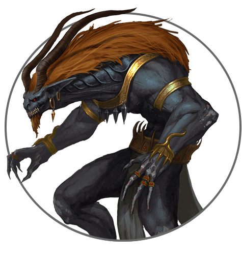
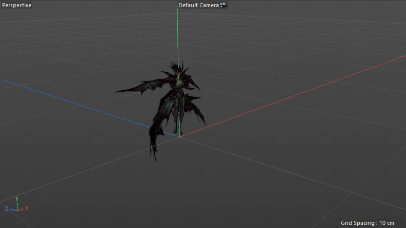
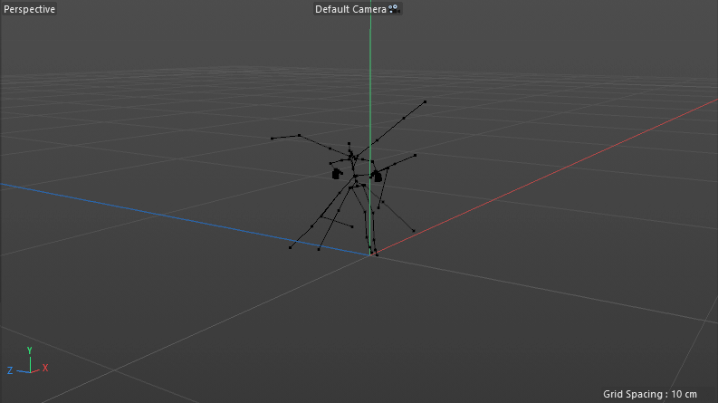
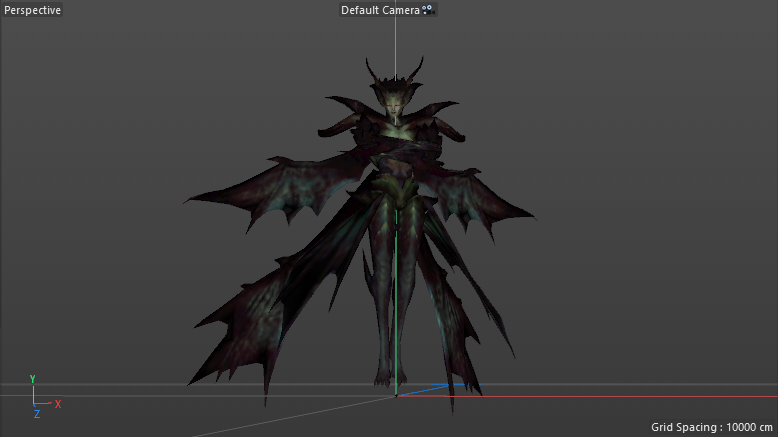
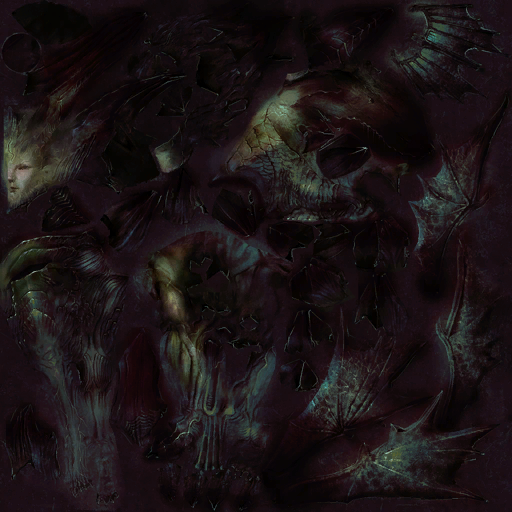

# ChaosLib λ

    // ------------------------------------------------------------
    // ChaosLib - Last Chaos Library (Alpha, under construction)
    // Written in .NET 5 | C# 9.0
    // ------------------------------------------------------------
    // ChaosLib.D3D        3D Utilites
    // ChaosLib.MAP        Game Data Mapper
    // ------------------------------------------------------------


<br/>

## [ChaosLib.D3D](https://github.com/5z3f/ChaosLib/tree/main/ChaosLib.D3D)
### Currently Available
* __Binary Importer__
  * ``BM`` Last Chaos Mesh (Version 16 & 17)
  * ``BM`` Serious Engine 1.10 Mesh (Version 11 & 12)
  * ``BS`` Last Chaos Skeleton
  * ``BA`` Last Chaos Animation
  * ``BAE`` Last Chaos Animation Effect
  * ``TEX`` Last Chaos Texture
* __Binary Exporter__
  * ``BM`` Last Chaos Mesh (Version 17)
  * ``BM`` Serious Engine 1.10 Mesh (Version 12)
  * ``BS`` Last Chaos Skeleton
  * ``BA`` Last Chaos Animation
  * ``BAE`` Last Chaos Animation Effect
* __ASCII Exporter__
  * ``AM`` Mesh 0.1
  * ``AS`` Skeleton 0.1
  * ``AA`` Animation 0.1
  * ``AAL`` Animset List
* __OBJ Exporter__
  * ``OBJ`` Mesh (with UV) (this format does not support weight maps which are needed for animations)
* __GLTF Exporter__
  * ``GLTF/GLB`` Mesh (without weight maps) (if .png textures exists in saving directory they will be packed into .glb file)

## [ChaosLib.MAP](https://github.com/5z3f/ChaosLib/tree/main/ChaosLib.Map)
### Currently Available
* __Binary Importer__
  * ``LOD`` Action
  * ``LOD`` Combo
  * ``LOD`` Notice
  * ``LOD`` Option

## Known issues
* Rotation in animation is unstable, quaternion correction needed
* Skeleton should be child->parent sorted before exporting
  
## Showcase
### ``.BA >> .AA >> Milkshape 3D >> .FBX >> Cinema 4D``

```cs
ChaosAsset chaosAsset = new ChaosAsset();
var dataObject = chaosAsset.Import(AssetType.Animation, "besurel.ba", AssetDataType.Binary);
chaosAsset.Export(AssetType.Animation, dataObject.Animations[0], "attack01.aa", AssetDataType.ASCII);
```



### ``.BS >> .AS >> Milkshape 3D >> .FBX >> Cinema 4D``

```cs
ChaosAsset chaosAsset = new ChaosAsset();
var dataObject = chaosAsset.Import(AssetType.Skeleton, "besurel.bs", AssetDataType.Binary);
chaosAsset.Export(AssetType.Skeleton, dataObject, "besurel.as", AssetDataType.ASCII);
```



### ``.BM >> .OBJ >> Cinema 4D``

```cs
ChaosAsset chaosAsset = new ChaosAsset();
var dataObject = chaosAsset.Import(AssetType.Mesh, "besurel.bm", AssetDataType.Binary);
chaosAsset.Export(AssetType.Mesh, dataObject, "besurel.obj", AssetDataType.OBJ);
```



### ``.TEX >> .PNG``

```cs
ChaosAsset chaosAsset = new ChaosAsset();
var texture = chaosAsset.Import(AssetType.Texture, "besurel.tex", AssetDataType.Binary);
Bitmap bmp = texture.Image;
bmp.Save("besurel.png", ImageFormat.Png);
```



## Contributors
* [Karmel0x](https://github.com/Karmel0x) - his knowledge and helping hand 
